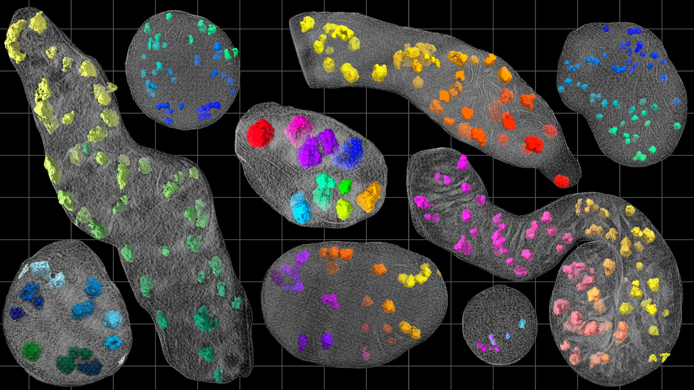

# 3D Segmentation of Mitochondrial Structures

A Deep Learning package for accurate segmentation of mitochondria and granules captured using cryo-electron tomography. This repository contains code for our papers
- **[CryoET Reveals Organelle Phenotypes in Huntington Disease Patient iPSC-Derived and Mouse Primary Neurons](https://www.nature.com/articles/s41467-023-36096-w)**
- **Robust and Label-Efficient Segmentation of Mitochondrial Structures in Cryo-electron Tomograms**

If you use these scripts or data for your research, please cite as
```bibtex
@article{wu2023cryoet,
  title={CryoET reveals organelle phenotypes in huntington disease patient iPSC-derived and mouse primary neurons},
  author={Wu, Gong-Her and Smith-Geater, Charlene and Galaz-Montoya, Jes{\'u}s G and Gu, Yingli and Gupte, Sanket R and Aviner, Ranen and Mitchell, Patrick G and Hsu, Joy and Miramontes, Ricardo and Wang, Keona Q and others},
  journal={Nature Communications},
  volume={14},
  number={1},
  pages={692},
  year={2023},
  publisher={Nature Publishing Group UK London}
}
```

## Features
1. MitoSeg is a toolkit for performing quantitative analyses of mitochondrial structures at scale. It currently supports segmentation of mitochoindria and granules.
2. MitoSeg is powered by a 3D-UNet which is trained on a diverse set of samples spanning multiple conditions and is capable of generalizing well to novel samples.
3. The trained models can be used out-of-the-box for segmentation using the included inference scripts. We also provide tools for fine-tuning models for new datasets.
4. Models are pre-trained using self-supervision and can be finetuned by labeling as few as 5 slices per tomogram.

## Getting Started

### Requirements
#### Software Requirements
- PyTorch v1.12.1
- CUDA Toolkit 11.6
- Additional packages contained in `environment.yml`
- Software dependencies are managed using Anaconda

#### Hardware Requirements
Our models run on NVIDIA GPUs and are quite memory intensive, so we would recommend using a GPU with a high memory capacity.

## Installation
1. Clone the repository
`git clone git@github.com:sanketx/sanketx.github.io.git`

## Usage
This repository is under active development - detailed instructions for usage will be uploaded soon.

